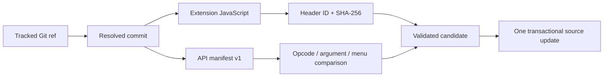

# Extension API compatibility manifests

An embedded extension can opt in to a versioned API manifest so that `sb3-toolchain` checks the
saved-project contract before replacing its JavaScript. The manifest is validation metadata: it is
kept in expanded source, fetched from the same immutable commit as the JavaScript, and never embedded
in the generated SB3.

This feature is optional. Existing unmanaged extensions and managed extensions without
`source.apiManifest` keep their previous behavior and deterministic SB3 output.

## Why a second artifact is necessary

Commit pinning and SHA-256 answer whether a JavaScript artifact is authentic and reproducible. They
do not answer whether an update still provides the opcodes and argument shapes already stored in a
project.



The manifest is parsed as JSON and is never executed. `sb3-toolchain` validates manifest v1 locally
instead of downloading a schema during a check or build.

## Expanded-source metadata

Add `apiManifest` below an existing GitHub `source` object:

```json
{
  "id": "example",
  "path": "extensions/example.js",
  "mediaType": "text/javascript",
  "parameters": [],
  "encoding": "base64",
  "source": {
    "provider": "github",
    "repository": "owner/example-extension",
    "ref": "main",
    "resolvedCommit": "0123456789abcdef0123456789abcdef01234567",
    "artifact": "dist/example.js",
    "integrity": "sha256-AAAAAAAAAAAAAAAAAAAAAAAAAAAAAAAAAAAAAAAAAAA=",
    "apiManifest": {
      "artifact": "dist/extension-manifest.json",
      "path": "extensions/example.manifest.json",
      "formatVersion": 1,
      "integrity": "sha256-BBBBBBBBBBBBBBBBBBBBBBBBBBBBBBBBBBBBBBBBBBB="
    }
  }
}
```

- `artifact` is the manifest path in the GitHub repository.
- `path` must be `extensions/<extensionId>.manifest.json` in expanded source.
- `formatVersion` must be `1`.
- `integrity` is the SHA-256 SRI value of the installed manifest file.

The JavaScript and manifest artifacts use the same repository and `resolvedCommit`. Separate
repositories or commits are intentionally unsupported because they would make the recorded API
contract ambiguous.

## Manifest v1 contract

Manifest v1 contains:

- the extension ID;
- block opcode and block type;
- argument ID, type, and optional menu reference;
- menu ID and `acceptReporters`.

Unknown properties, duplicate identifiers, unknown menu references, unsupported versions, and ID
mismatches are rejected. Array order is normalized before comparison.

Display text, descriptions, default values, static menu items, labels, separators, and palette order
are outside manifest v1. They do not identify saved-project API references. Extension bundling
therefore continues to use `extensionBundles[].members` and runtime `getInfo().blocks` order; it does
not use manifest order to build the palette.

## Compatibility policy

| Candidate change             | Classification | Reason                                               |
| ---------------------------- | -------------- | ---------------------------------------------------- |
| Add a block                  | Compatible     | Existing saved blocks keep their handler             |
| Add an unreferenced menu     | Compatible     | No existing argument contract changes                |
| Remove a block               | Breaking       | Saved opcodes lose their handler                     |
| Change a block type          | Breaking       | Saved block shape or evaluation changes              |
| Add or remove an argument    | Breaking       | Manifest v1 cannot prove a safe default or migration |
| Change argument type or menu | Breaking       | Saved input interpretation changes                   |
| Remove a menu                | Breaking       | Existing menu references can no longer resolve       |
| Change `acceptReporters`     | Breaking       | Accepted saved input shapes change                   |

Compatibility reports use stable paths such as:

```text
/blocks/speak/blockType
/blocks/speak/arguments/VOICE/menu
/menus/voices/acceptReporters
```

An ID migration explicitly normalizes the old and new top-level IDs before comparing the remaining
contract. Any other API difference follows the same policy.

## Status, sync, and update

`extensions status` validates both installed files offline when reporting `local=valid` or
`local=modified`. It resolves only the tracked Git ref and does not download a candidate manifest.

`extensions sync` downloads both artifacts from the recorded `resolvedCommit`. Both must match their
recorded integrity and IDs before either local file is replaced.

`extensions update` resolves `ref`, downloads both artifacts from the new commit, validates them, and
compares the candidate API with the installed manifest. New blocks are reported as compatible.
Breaking changes are rejected before a candidate directory is installed.

To apply an intentionally breaking update, review every reported path and use both explicit flags:

```bash
sb3-toolchain extensions update app EXTENSION_ID --allow-breaking-api --yes
```

`--allow-breaking-api` without `--yes` is rejected. This prevents an ordinary replacement
confirmation from also authorizing an API break.

The JavaScript, API manifest, `resolvedCommit`, and both integrity values are written in one
transaction. If one download or validation fails, expanded source is unchanged.

## Check, build, and import

`check` and `build` verify the installed API manifest without network access. The manifest does not
enter `project.json` or the SB3 ZIP, so opting in does not change the generated SB3 bytes.

Re-importing an unchanged SB3 into an existing managed expanded source preserves both
`source.apiManifest` and its installed manifest file. A new import cannot infer GitHub provenance or
manifest metadata, so it does not enable the feature automatically.

## Rollback

For a project update, revert the project commit so that JavaScript, API manifest,
`resolvedCommit`, and both integrity values return together.

To stop API compatibility tracking without changing the embedded JavaScript:

1. Remove `source.apiManifest` from the extension entry.
2. Remove `extensions/<extensionId>.manifest.json`.
3. Run `sb3-toolchain check` and rebuild the SB3.

The extension then follows the previous JavaScript provenance and integrity workflow.
