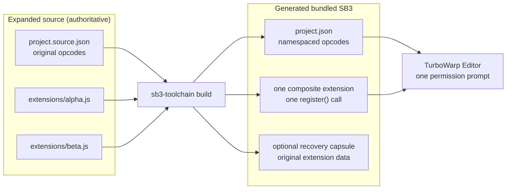
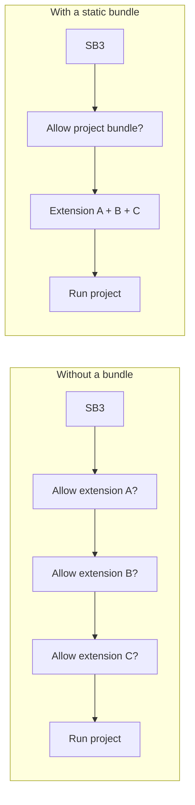
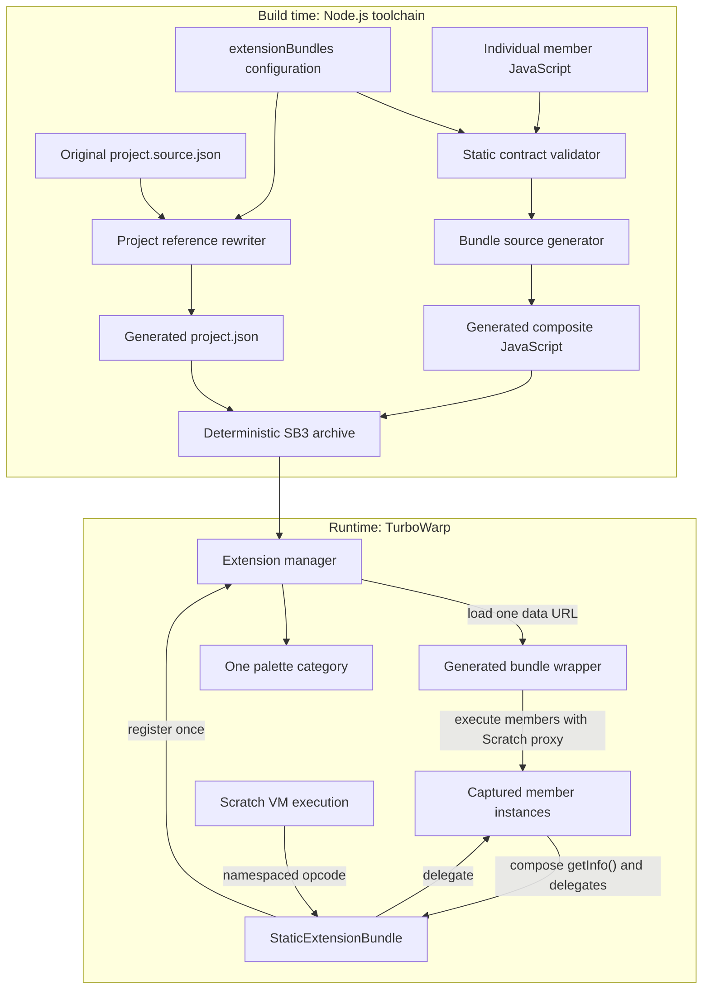
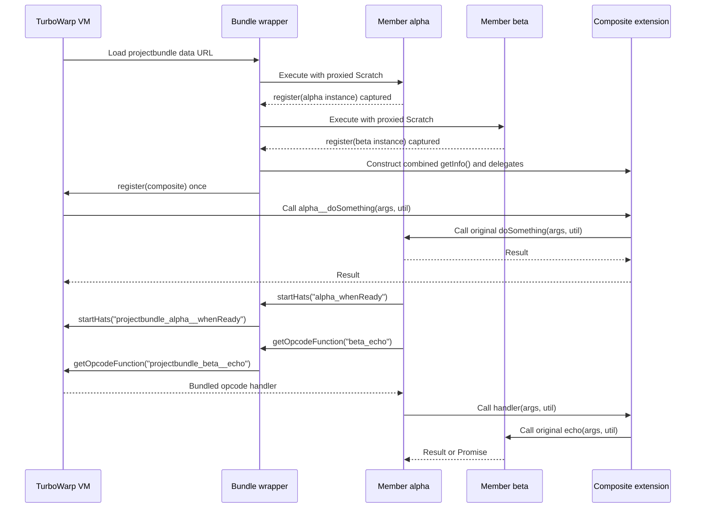
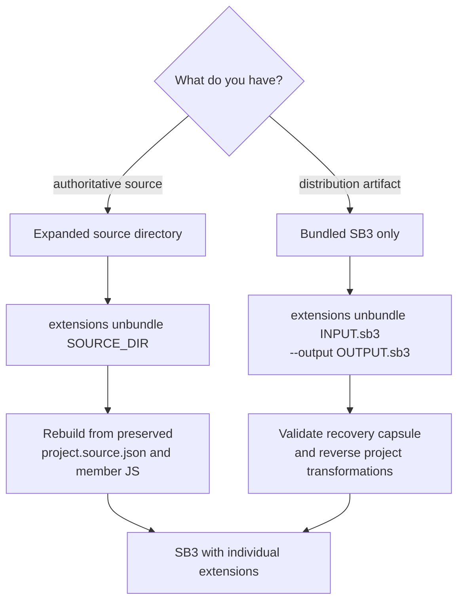
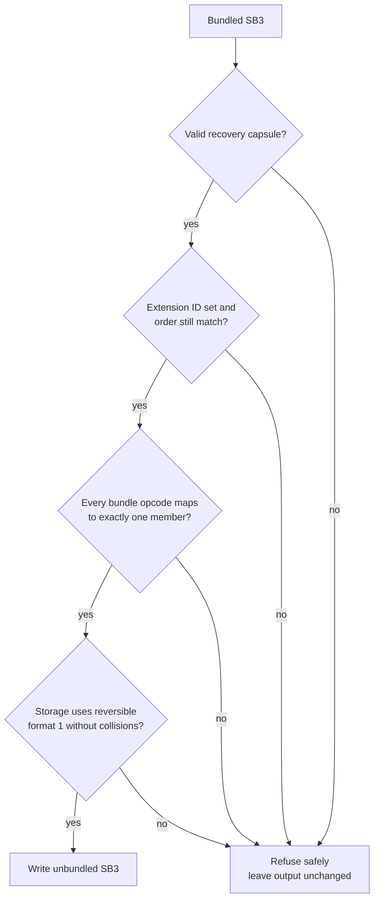

# Static bundles for embedded extensions

[日本語版](ja/extension-bundles.md)

When a newly opened SB3 contains several unsandboxed extensions, TurboWarp asks for permission to
run each extension. A static bundle keeps the individual extensions in the expanded source but
transforms only the generated SB3 into one composite extension, reducing the permission unit to
one extension.

## Overview



The expanded source always retains the individual extensions. Bundling changes only the generated
SB3. The default recovery capsule makes that generated artifact reversible when its safety
conditions remain satisfied; an explicit compact configuration can omit it.

## What problem it solves

TurboWarp grants unsandboxed execution permission per loaded custom extension. A project with three
embedded extensions therefore presents three prompts even when all three are maintained and shipped
as one project. The bundle changes the loading boundary, not the security decision itself.



The user still reviews and authorizes unsandboxed JavaScript. The difference is that the generated
SB3 exposes one composite extension ID and one embedded extension URL, so TurboWarp has one custom
extension to authorize and load.

### What it is and what it is not

| This feature does                                                 | This feature does not                                        |
| ----------------------------------------------------------------- | ------------------------------------------------------------ |
| Create one composite runtime extension from several members       | Disable or bypass TurboWarp's permission prompt              |
| Rewrite generated project references to collision-free namespaces | Rewrite the authoritative source project in place            |
| Preserve and delegate each member's original implementation       | Flatten all member classes into one manually merged class    |
| Embed recovery data by default for direct SB3 unbundling          | Guarantee compatibility for arbitrary dynamic extension code |
| Reject transformations that cannot be classified safely           | Execute extension JavaScript during the build                |

## Internal architecture

Bundling has separate build-time and runtime layers. Build time validates and rewrites data without
executing extension JavaScript. Runtime uses a generated wrapper to capture each member registration,
combine its metadata, and delegate calls.



### Anatomy of the generated JavaScript

The generated data URL is a self-contained classic extension script with these layers:

```text
projectbundle.js
├── human-readable bundle header
│   └── member name, ID, author, description, and license
├── runtime adapter
│   ├── Scratch proxy for each member
│   ├── synchronous register() capture
│   ├── opcode, menu, custom-field, and hat namespaces
│   └── global and target storage aliases
├── original member source A
├── original member source B
├── StaticExtensionBundle
│   ├── combined getInfo()
│   ├── generated palette headings and separators
│   └── handlers that delegate to captured member instances
├── one real Scratch.extensions.register() call
└── optional SB3-Toolchain-Reversible-Bundle-v1 recovery capsule
```

The original scripts still execute their normal initialization code at runtime. Their calls to
`Scratch.extensions.register()` are intercepted by a member-specific Scratch proxy instead of being
sent to TurboWarp. After every member registers exactly once, the wrapper registers the composite
extension with the real API.

### Runtime call flow



### Data transformations

| Concern                     | Before bundling                           | Generated bundled SB3                         |
| --------------------------- | ----------------------------------------- | --------------------------------------------- |
| Loaded extension IDs        | `alpha`, `beta`                           | `projectbundle`                               |
| Embedded data URLs          | One per member                            | One composite data URL                        |
| Member `getInfo()` opcode   | `doSomething`                             | `alpha__doSomething`                          |
| Stored project opcode       | `alpha_doSomething`                       | `projectbundle_alpha__doSomething`            |
| Menu and custom-field names | Member-local names                        | `memberId__` namespace                        |
| `startHats()` opcode        | `alpha_whenReady`                         | `projectbundle_alpha__whenReady`              |
| `getOpcodeFunction()`       | `beta_echo`                               | `projectbundle_beta__echo`                    |
| Extension storage           | `storage.alpha`, `storage.beta`           | `storage.projectbundle.components.alpha/beta` |
| Block IDs and graph links   | Original IDs and `next`/`parent`/`inputs` | Unchanged                                     |

This split is why existing scripts continue to call their original methods while the saved project
uses the composite extension ID expected by TurboWarp.

## Compatibility and reversibility

Bundle configuration is added only to `embedded-extensions.json`. The following authoritative
sources are not modified:

- Original JavaScript in `extensions/<extensionId>.js`
- Individual extension entries and `source` provenance in `embedded-extensions.json`
- Original extension IDs, block and monitor opcodes, and extension storage in `project.source.json`

`check` and `extensions status|sync|update` continue to validate and update individual extensions.
Only `build` transforms the in-memory `project.json` and embedded JavaScript into their bundled
representation. There is no mode that deletes the original files.

An extension that cannot be transformed safely is rejected instead of being bundled with changed
behavior. The current static-bundle contract requires all of the following:

- Every member has Extension Gallery-style `Name`, `ID`, `Description`, `By`, and `License` headers
- The header ID, manifest ID, and runtime `getInfo().id` are identical
- Every member is a classic script that calls `Scratch.extensions.register` exactly once and synchronously
- No member uses XML blocks
- No unclassified opcode references remain outside blocks, monitors, or dynamic block metadata

The bundle namespaces ordinary commands, reporters, booleans, events, buttons, labels, static and
dynamic menus, custom fields, and global and target extension storage. Calls from child extensions
to `runtime.startHats` are also translated to bundled opcodes. When a member calls
`runtime.getOpcodeFunction()`, an opcode beginning with any member ID in the same bundle is
translated at runtime. This supports both self references and calls to another member, such as an
Asset Manager member resolving an Animated Text member's handler.

Only the opcode passed to `getOpcodeFunction()` is adapted. The function returned by the VM is
passed through unchanged, so its binding, handler arguments, synchronous result, or Promise result
are preserved. Core, external-extension, and unknown opcodes whose prefix is not a bundle member ID
are passed to the VM unchanged. Other APIs that carry opcode strings are outside this compatibility
contract unless documented separately.

The bundle preserves the `members` order from the manifest and the block-definition order within
each member's `getInfo().blocks`. In the TurboWarp Editor palette, each group begins with a decorated
LABEL heading in this form:

```text
◆ <name> [<memberId>] ◆
```

Putting the member name first keeps it visible in TurboWarp's narrow palette. Two consecutive `---`
separators divide member groups. A generated LABEL also carries the following machine-readable
metadata:

```js
{
  sb3Toolchain: {
    kind: 'bundle-member-heading',
    memberId,
  },
}
```

For every ordinary block that does not already define its own `blockIconURI`, the bundle copies the
member's top-level `getInfo().blockIconURI` onto the transformed block. TurboWarp supports
`blockIconURI` at block level, so blocks keep their originating extension's icon even though the
bundle is registered as one extension. A block-specific icon always wins, and members without an
icon keep the previous icon-free output. Generated headings, documentation buttons, member LABELs,
and member BUTTONs are not given an inherited icon.

When a member's `getInfo()` returns a non-empty string [`docsURI`](https://docs.turbowarp.org/development/extensions/assorted-apis#docsuri),
the bundle inserts an `Open Documentation` button immediately after that member's heading. It uses TurboWarp's native
`OPEN_EXTENSION_DOCS` callback, so it preserves the normal `docsURI` behavior instead of delegating
to extension code. The generated button carries separate metadata and safely XML-escapes the URI:

```js
{
  sb3Toolchain: {
    docsURI,
    kind: 'bundle-member-docs',
    memberId,
  },
}
```

No button is inserted for a member without `docsURI`. Member-provided XML blocks remain unsupported;
the tool generates only this narrowly defined documentation button XML.

LABEL entries and separators originally defined by a member are preserved unchanged and in their
original positions. The decorated bundle heading and wider double separator therefore remain
visually distinct from an original heading or ordinary separator. A tool can identify the generated
heading by its `sb3Toolchain` metadata and treat the two separators immediately before it as the
bundle group boundary.

The resulting palette has this visual hierarchy:

```text
┌─ Project Extension Bundle ─────────────────────────────┐
│ ◆ Alpha Tools [alpha] ◆                               │ ← generated heading
│   Open Documentation                                   │ ← generated docsURI button
│   alpha block 1                                        │
│   Alpha original heading                               │ ← original LABEL
│                                                       │ ← original separator
│   alpha block 2                                        │
│                                                       │
│                                                       │ ← generated double separator
│ ◆ Beta Tools [beta] ◆                                 │ ← generated heading
│   beta block 1                                         │
└────────────────────────────────────────────────────────┘
```

## Configure a bundle

Start with a dry run to validate the selected members, header metadata, collisions, and opcode
references.

```bash
sb3-toolchain extensions bundle app \
  --id projectbundle \
  --name "Project Extension Bundle" \
  extensionone extensiontwo
```

If member IDs are omitted, all embedded extensions not already assigned to another bundle are
selected. A bundle requires at least two members. Review the result before applying it.

```bash
sb3-toolchain extensions bundle app \
  --id projectbundle \
  --name "Project Extension Bundle" \
  extensionone extensiontwo \
  --yes
sb3-toolchain check app
sb3-toolchain build app --output dist/project.sb3
```

Member opcodes are transformed as follows in the generated SB3:

```text
Original extension getInfo() opcode:  doSomething
Bundle getInfo() opcode:              extensionone__doSomething
Original project.json opcode:         extensionone_doSomething
Bundled project.json opcode:          projectbundle_extensionone__doSomething
```

The bundle adds `memberId + "__"` to each original opcode, so identical opcodes from different
members cannot collide. Member IDs are restricted to `[a-z0-9]+`, making the delimiter unambiguous.
Loading the bundle is rejected if transformed opcodes still collide within the same member.

Only `projectbundle` appears in `extensions` and `extensionURLs`, and the generated JavaScript calls
`Scratch.extensions.register` once. The initial comments in that JavaScript list every member's
name, ID, author, description, and license so the user can inspect them before granting permission.

By default, the end of the JavaScript contains an `SB3-Toolchain-Reversible-Bundle-v1` recovery
capsule. The capsule records each original member data URL, member order, and the original
`extensions` and `extensionURLs` order.

Set `"recoveryCapsule": false` on a bundle, or pass `--omit-recovery-capsule` while configuring it,
to omit that duplicate payload. This is an explicit distribution decision: first confirm that every
member license permits modification and combination, keep all required notices and corresponding
source available, and accept that the generated SB3 cannot be directly unbundled. The bundle header,
member code, block icons, opcode namespaces, and storage behavior are unchanged. The default remains
reversible.

## Restore from expanded source

Choose the restoration path based on which artifact is available:



First inspect the unbundle plan with a dry run, then pass `--yes` to remove the bundle configuration.

```bash
sb3-toolchain extensions unbundle app projectbundle
sb3-toolchain extensions unbundle app projectbundle --yes
sb3-toolchain check app
sb3-toolchain build app --output dist/project.sb3 --yes
```

Because the original JavaScript and project representation are preserved, the next build restores
the individual IDs and data URLs and regenerates block, dynamic block metadata, and monitor opcodes
with their original values. This form of unbundle does not attempt to reverse-engineer a distribution
SB3. It regenerates the project from the saved `project.source.json` and individual JavaScript, so no
information is lost through an inferred opcode reversal. If `extensions update` ran while the bundle
was configured, the project is restored using the updated individual JavaScript.

Treat the expanded source as authoritative. Do not re-import a generated bundled SB3 into that same
authoritative source. Importing it into a new directory expands the distribution composite extension
as one ordinary extension and cannot recover the individual provenance. The normal Git-difference
protection and replacement confirmation still apply if an existing authoritative source is selected
accidentally.

## Restore a bundled SB3 directly

A bundled SB3 containing a recovery capsule can be unbundled without the expanded source. A bundle
built with `recoveryCapsule: false` must instead be restored from its authoritative expanded source. The
command is a dry run unless `--yes` is supplied.

```bash
sb3-toolchain extensions unbundle \
  dist/project.sb3 projectbundle \
  --output dist/project.unbundled.sb3
sb3-toolchain extensions unbundle \
  dist/project.sb3 projectbundle \
  --output dist/project.unbundled.sb3 \
  --yes
```

Direct unbundling restores all of the following:

- Bundle opcodes to `memberId_originalOpcode`, while leaving block IDs, `next`, `parent`, and `inputs` unchanged
- Opcodes in ordinary blocks, dynamic block metadata, and monitors
- The bundle storage `components` as storage keyed by the original member IDs
- Individual member data URLs and the original order of `extensions` and `extensionURLs`
- Asset entries and their byte contents

Blocks may be added, deleted, or moved in TurboWarp after bundling. An added block can still be
restored when its opcode has the `bundleId_memberId__originalOpcode` form. An SB3 containing several
bundles can be unbundled one bundle at a time in any order when every bundle has a valid recovery
capsule and their member sets do not overlap.

### Conditions that make direct unbundling impossible



The tool refuses the operation without modifying the output instead of guessing when any of the
following conditions apply:

- The target data URL has no `SB3-Toolchain-Reversible-Bundle-v1` capsule because the bundle was
  configured with `recoveryCapsule: false`, produced before recovery capsules were introduced, by
  another tool, or by hand
- The bundle data URL or capsule was removed, corrupted, or duplicated; its format version is not
  supported; or its bundle ID, member ID, and original JavaScript header ID do not agree
- The ID set or order in `project.extensions` or `extensionURLs` changed after bundling. For example,
  adding or removing another extension makes the exact insertion positions of the original members
  unsafe to infer
- An opcode beginning with `bundleId_` cannot be assigned to a member's `memberId__` namespace, or
  an unclassified bundle opcode reference remains outside ordinary blocks, dynamic block metadata,
  and monitors
- Bundle storage is not `{formatVersion: 1, components: {...}}`, contains an unknown member or an
  additional bundle-level field, or collides with storage already using a restored member ID
- Active reversible bundles contain overlapping members
- The ZIP is empty, `project.json` is missing or invalid, an entry name is unsafe, or entry order
  cannot be preserved safely

If the expanded source is still available, these conditions do not prevent the source-based
`extensions unbundle SOURCE_DIR` workflow from removing the bundle configuration and rebuilding the
project. An older generated SB3 without a recovery capsule cannot be reversed directly from that SB3
alone.

Direct unbundling preserves asset bytes but recompresses the ZIP deterministically. It does not
preserve byte-for-byte identity of input ZIP metadata, entry timestamps, or archive comments.

## Verification

Static validation cannot prove compatibility with browser APIs, cameras, the renderer, or implicit
dependencies between extensions. Run the same project-level automated tests before and after
bundling, then open the generated SB3 in a fresh TurboWarp session and verify all of the following:

- The unsandboxed execution prompt appears only once
- Green flag behavior and block, reporter, hat, monitor, and menu results are unchanged
- Permission paths used by the project, such as camera, network, file picker, and renderer access, work
- An SB3 saved again by TurboWarp retains extension storage and still works after reloading

Exclude a member from the bundle and keep it as an individual extension when its compatibility
cannot be verified.
