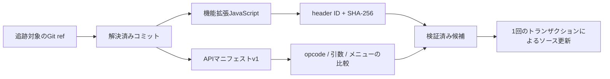

# Extension API互換性マニフェスト

[English](../extension-api-compatibility.md)

埋め込み機能拡張は、バージョン付きAPIマニフェストを任意で使用できます。これにより、
`sb3-toolchain`はJavaScriptを置き換える前に、保存済みプロジェクトとの契約を検査します。
マニフェストは検証用メタデータです。展開ソース内に保存され、JavaScriptと同じ変更不能なコミットから
取得されますが、生成するSB3には埋め込まれません。

この機能は任意です。管理対象外の既存機能拡張と、`source.apiManifest`を持たない管理対象機能拡張は、
従来の動作と決定的なSB3出力を維持します。

## 2つ目の成果物が必要な理由

コミット固定とSHA-256によって、JavaScript成果物が真正かつ再現可能かを確認できます。しかし、更新後も、
既存プロジェクトに保存されているopcodeや引数の形が提供されるかどうかは確認できません。



マニフェストはJSONとして解析され、実行されることはありません。`sb3-toolchain`はcheckまたはbuildの
実行時にスキーマを取得せず、マニフェストv1をローカルで検証します。

## 展開ソースのメタデータ

既存のGitHub `source`オブジェクトの下に`apiManifest`を追加します。

```json
{
  "id": "example",
  "path": "extensions/example.js",
  "mediaType": "text/javascript",
  "parameters": [],
  "encoding": "base64",
  "source": {
    "provider": "github",
    "repository": "owner/example-extension",
    "ref": "main",
    "resolvedCommit": "0123456789abcdef0123456789abcdef01234567",
    "artifact": "dist/example.js",
    "integrity": "sha256-AAAAAAAAAAAAAAAAAAAAAAAAAAAAAAAAAAAAAAAAAAA=",
    "apiManifest": {
      "artifact": "dist/extension-manifest.json",
      "path": "extensions/example.manifest.json",
      "formatVersion": 1,
      "integrity": "sha256-BBBBBBBBBBBBBBBBBBBBBBBBBBBBBBBBBBBBBBBBBBB="
    }
  }
}
```

- `artifact`はGitHubリポジトリ内のマニフェストのパスです。
- `path`は展開ソース内の`extensions/<extensionId>.manifest.json`でなければなりません。
- `formatVersion`は`1`でなければなりません。
- `integrity`はインストール済みマニフェストファイルのSHA-256 SRI値です。

JavaScript成果物とマニフェスト成果物は、同じリポジトリと`resolvedCommit`を使用します。別のリポジトリや
コミットは、記録されたAPI契約を曖昧にするため、意図的にサポートしていません。

## マニフェストv1の契約

マニフェストv1には次の情報が含まれます。

- 機能拡張ID
- ブロックのopcodeとブロック種別
- 引数のID、型、任意のメニュー参照
- メニューのIDと`acceptReporters`

未知のプロパティ、識別子の重複、未知のメニュー参照、未対応バージョン、ID不一致は拒否されます。配列の順序は、
比較前に正規化されます。

表示テキスト、説明、デフォルト値、静的メニュー項目、`label`、`separator`、パレット順序はマニフェストv1の
対象外です。これらは保存済みプロジェクトのAPI参照を識別するものではありません。そのため、機能拡張の
bundleでは、引き続き`extensionBundles[].members`と実行時の`getInfo().blocks`の順序を使用します。
パレット構築にマニフェストの順序は使用しません。

## 互換性ポリシー

| 候補の変更               | 分類       | 理由                                                   |
| ------------------------ | ---------- | ------------------------------------------------------ |
| ブロックを追加           | Compatible | 既存の保存済みブロックは処理を維持する                 |
| 未参照メニューを追加     | Compatible | 既存の引数契約は変わらない                             |
| 未参照メニューを削除     | Compatible | 保存済み引数から参照されていない                       |
| ブロックを削除           | Breaking   | 保存済みopcodeの処理が失われる                         |
| ブロック種別を変更       | Breaking   | 保存済みブロックの形または評価方法が変わる             |
| 引数を追加または削除     | Breaking   | マニフェストv1では安全なデフォルトや移行を証明できない |
| 引数の型やメニューを変更 | Breaking   | 保存済み入力の解釈が変わる                             |
| 参照中メニューを削除     | Breaking   | 既存のメニュー参照を解決できなくなる                   |
| `acceptReporters`を変更  | Breaking   | 受け入れ可能な保存済み入力の形が変わる                 |

互換性レポートでは、次のような安定したパスを使用します。

```text
/blocks/speak/blockType
/blocks/speak/arguments/VOICE/menu
/menus/voices/acceptReporters
```

ID移行では、明示された旧IDと新IDのトップレベルIDだけを正規化してから、残りの契約を比較します。それ以外の
API差分には、同じ互換性ポリシーを適用します。

リモートのマニフェストファイル名も機能拡張IDとともに変わる場合は、新しいパスを明示します。

```bash
sb3-toolchain extensions update app OLD_ID --migrate-id NEW_ID \
  --artifact dist/newid.js \
  --api-manifest-artifact dist/newid.manifest.json
```

2つの成果物パスとintegrity値は、同じトランザクションで更新されます。

## Status、sync、update

`extensions status`は、`local=valid`または`local=modified`を報告するとき、インストール済みの2つの
ファイルをオフラインで検証します。追跡対象のGit refだけを解決し、候補マニフェストはダウンロードしません。

`extensions sync`は、記録済みの`resolvedCommit`から2つの成果物をダウンロードします。ローカルファイルを
置き換える前に、両方のIDと記録済みintegrityが一致しなければなりません。

`extensions update`は`ref`を解決し、新しいコミットから両方の成果物をダウンロードして検証した後、候補APIと
インストール済みマニフェストを比較します。新しいブロックはCompatibleとして報告されます。Breakingに分類される
変更がある場合、候補ディレクトリをインストールする前に拒否します。

意図的に破壊的更新を適用する場合は、報告されたすべてのパスを確認し、次の2つの明示的なフラグを使用します。

```bash
sb3-toolchain extensions update app EXTENSION_ID --allow-breaking-api --yes
```

`--yes`を伴わない`--allow-breaking-api`は拒否されます。これにより、通常の置換確認がAPI破壊の許可を
兼ねてしまうことを防ぎます。

JavaScript、APIマニフェスト、`resolvedCommit`、2つのintegrity値は、1回のトランザクションで書き込まれます。
ダウンロードまたは検証のいずれかが失敗した場合、展開ソースは変更されません。

## Check、build、import

`check`と`build`は、ネットワークへ接続せずにインストール済みAPIマニフェストを検証します。マニフェストは
`project.json`やSB3 ZIPへ追加されないため、この機能を有効にしても生成されるSB3のバイト列は変わりません。

変更されていないSB3を既存の管理対象展開ソースへ再インポートすると、`source.apiManifest`とインストール済み
マニフェストファイルの両方が保持されます。新規インポートではGitHubの来歴やマニフェストメタデータを
推測できないため、この機能を自動的に有効にはしません。既存のマニフェストメタデータを読み込むのは、
インポートしたIDとパスが一致する機能拡張だけです。また、マニフェストファイルを開く前にローカルパスを
検証します。

## ロールバック

プロジェクトを更新した場合は、プロジェクトのコミットをrevertし、JavaScript、APIマニフェスト、
`resolvedCommit`、2つのintegrity値をまとめて元に戻します。

埋め込みJavaScriptを変更せずにAPI互換性の追跡を停止するには、次の手順を実行します。

1. 機能拡張エントリから`source.apiManifest`を削除します。
2. `extensions/<extensionId>.manifest.json`を削除します。
3. `sb3-toolchain check`を実行し、SB3を再ビルドします。

その後、機能拡張は従来のJavaScript来歴とintegrityのワークフローに戻ります。
