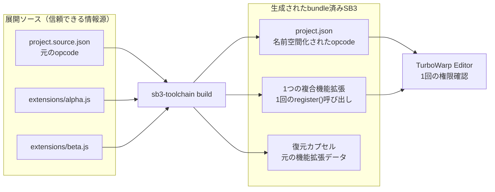
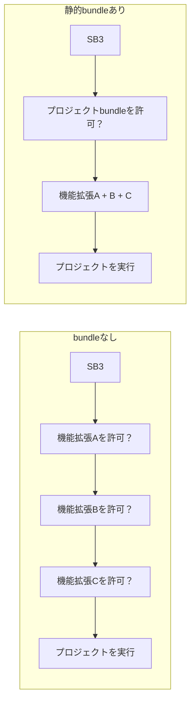
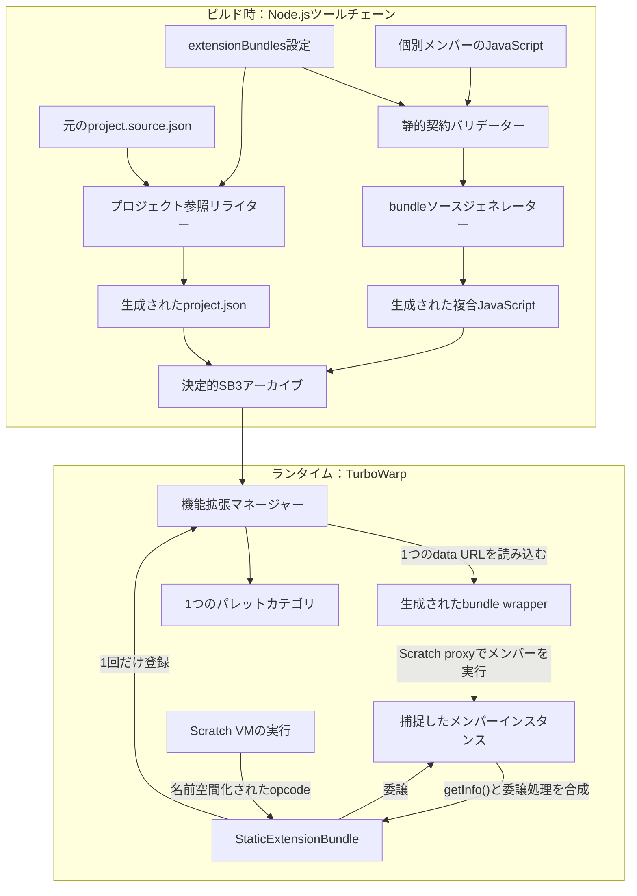
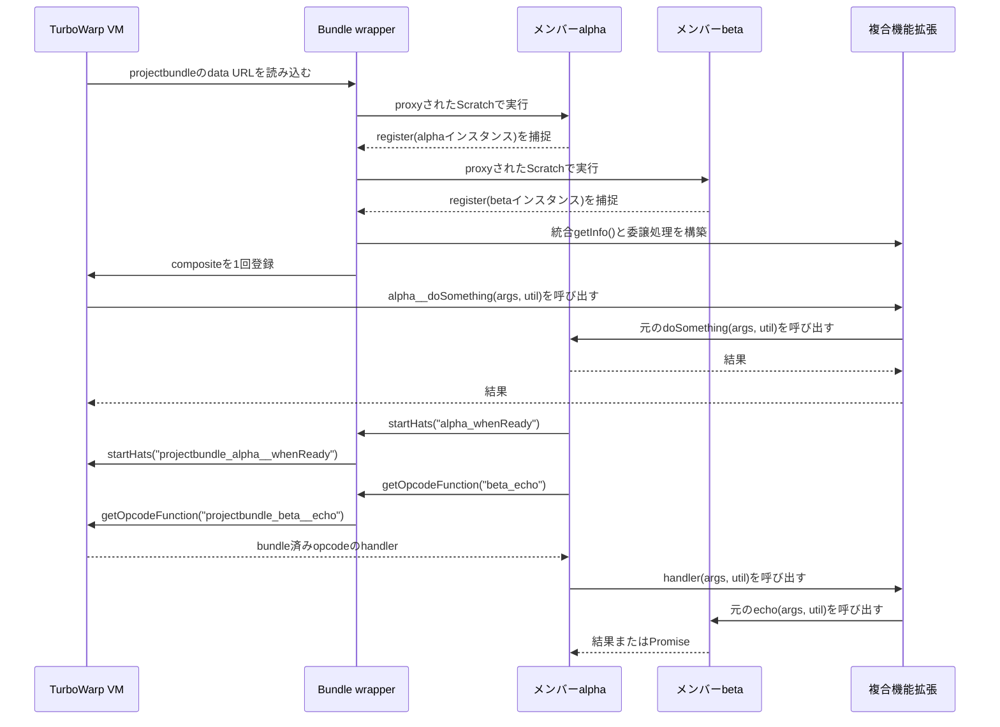
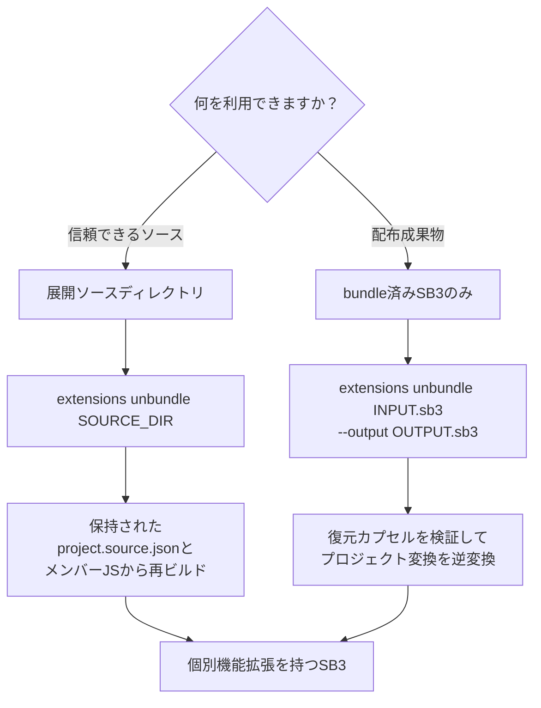
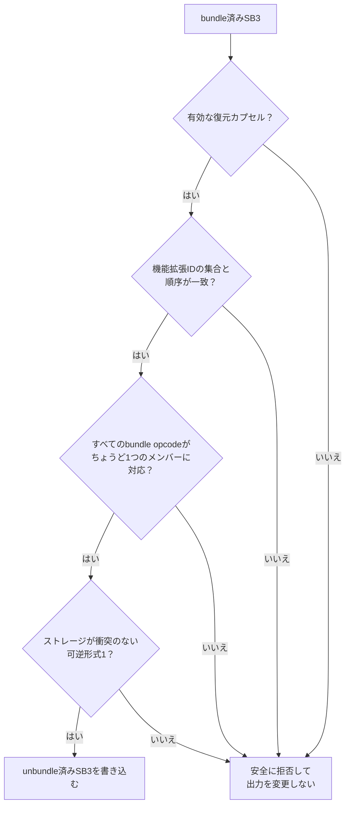

# 埋め込み機能拡張の静的bundle

[English](../extension-bundles.md)

新しく開いたSB3に複数のunsandboxed機能拡張が含まれていると、TurboWarpは各機能拡張の実行許可を求めます。
静的bundleは個別機能拡張を展開ソースに保持しながら、生成SB3だけを1つの複合機能拡張へ変換し、権限単位を
1つの機能拡張にまとめます。

## 概要



展開ソースには、常に個別機能拡張が保持されます。bundleによって変わるのは生成SB3だけです。安全条件を満たす
間は、復元カプセルによって生成成果物を元に戻せます。

## 解決する問題

TurboWarpは、読み込んだカスタム機能拡張ごとにunsandboxed実行の許可を与えます。そのため、3つすべてが
1つのプロジェクトとして保守・配布されていても、3つの埋め込み機能拡張を含むプロジェクトでは3回の確認が
表示されます。bundleが変更するのは読み込みの境界であり、セキュリティ上の判断そのものではありません。



ユーザーは引き続きunsandboxed JavaScriptを確認し、許可します。生成SB3が公開する複合機能拡張IDと埋め込み
機能拡張URLが1つになるため、TurboWarpが許可して読み込むカスタム機能拡張も1つになる点が異なります。

### この機能で行うこと、行わないこと

| この機能で行うこと                                   | この機能で行わないこと                           |
| ---------------------------------------------------- | ------------------------------------------------ |
| 複数メンバーから1つの複合ランタイム機能拡張を作成    | TurboWarpの権限確認を無効化または回避            |
| 生成プロジェクトの参照を衝突しない名前空間へ書き換え | 信頼できる情報源であるプロジェクトを直接書き換え |
| 各メンバーの元の実装を保持して処理を委譲             | すべてのメンバークラスを手作業で1クラスへ平坦化  |
| SB3を直接unbundleするための復元データを埋め込み      | 任意の動的な機能拡張コードに対する互換性を保証   |
| 安全に分類できない変換を拒否                         | ビルド中に機能拡張JavaScriptを実行               |

## 内部アーキテクチャ

bundle処理は、ビルド時とランタイムの層に分かれます。ビルド時には機能拡張JavaScriptを実行せず、データを
検証して書き換えます。ランタイムでは、生成したwrapperで各メンバーの登録を捕捉し、メタデータを統合して、
呼び出しを委譲します。



### 生成JavaScriptの構造

生成されるdata URLは、次の層で構成される自己完結したclassic機能拡張スクリプトです。

```text
projectbundle.js
├── 人が読めるbundleヘッダー
│   └── メンバーの名前、ID、作者、説明、ライセンス
├── ランタイムアダプター
│   ├── 各メンバーのScratch proxy
│   ├── 同期register()の捕捉
│   ├── opcode、メニュー、カスタムフィールド、hatの名前空間
│   └── グローバルおよびターゲットストレージの別名
├── 元のメンバーソースA
├── 元のメンバーソースB
├── StaticExtensionBundle
│   ├── 統合されたgetInfo()
│   ├── 生成されたパレット見出しとseparator
│   └── 捕捉したメンバーインスタンスへ委譲するhandler
├── 実際のScratch.extensions.register()呼び出し1回
└── SB3-Toolchain-Reversible-Bundle-v1復元カプセル
```

元のスクリプトは、ランタイムで通常の初期化コードを引き続き実行します。各スクリプトの
`Scratch.extensions.register()`呼び出しはTurboWarpへ送られず、メンバー固有のScratch proxyに捕捉されます。
すべてのメンバーがちょうど1回ずつ登録された後、wrapperは実際のAPIに複合機能拡張を登録します。

### ランタイム呼び出しフロー



### データ変換

| 対象                           | bundle前                           | 生成されたbundle済みSB3                       |
| ------------------------------ | ---------------------------------- | --------------------------------------------- |
| 読み込まれる機能拡張ID         | `alpha`、`beta`                    | `projectbundle`                               |
| 埋め込みdata URL               | メンバーごとに1つ                  | 1つの複合data URL                             |
| メンバー`getInfo()`のopcode    | `doSomething`                      | `alpha__doSomething`                          |
| 保存されるプロジェクトopcode   | `alpha_doSomething`                | `projectbundle_alpha__doSomething`            |
| メニューとカスタムフィールド名 | メンバー内の名前                   | `memberId__`名前空間                          |
| `startHats()`のopcode          | `alpha_whenReady`                  | `projectbundle_alpha__whenReady`              |
| `getOpcodeFunction()`          | `beta_echo`                        | `projectbundle_beta__echo`                    |
| 機能拡張ストレージ             | `storage.alpha`、`storage.beta`    | `storage.projectbundle.components.alpha/beta` |
| ブロックIDとグラフリンク       | 元のIDと`next`／`parent`／`inputs` | 変更なし                                      |

この分離により、保存済みプロジェクトがTurboWarpの期待する複合機能拡張IDを使用する一方、既存スクリプトは元の
メソッドを呼び出し続けられます。

## 互換性と可逆性

bundle設定は`embedded-extensions.json`だけに追加されます。信頼できる情報源である次のデータは変更されません。

- `extensions/<extensionId>.js`内の元のJavaScript
- `embedded-extensions.json`内の個別機能拡張エントリと`source`来歴
- `project.source.json`内の元の機能拡張ID、ブロックとmonitorのopcode、機能拡張ストレージ

`check`と`extensions status|sync|update`は、引き続き個別機能拡張を検証・更新します。`build`だけが
メモリ上の`project.json`と埋め込みJavaScriptをbundle表現へ変換します。元のファイルを削除するモードは
ありません。

安全に変換できない機能拡張は、動作を変えてbundleするのではなく拒否されます。現在の静的bundle契約では、
次のすべてを満たす必要があります。

- すべてのメンバーがExtension Gallery形式の`Name`、`ID`、`Description`、`By`、`License`ヘッダーを持つ
- ヘッダーID、マニフェストID、ランタイム`getInfo().id`が同一である
- すべてのメンバーが`Scratch.extensions.register`をちょうど1回かつ同期的に呼び出すclassicスクリプトである
- XMLブロックを使用するメンバーがない
- ブロック、monitor、動的ブロックメタデータ以外に未分類のopcode参照が残らない

bundleは、通常のcommand、reporter、boolean、event、button、label、静的および動的メニュー、
カスタムフィールド、グローバルおよびターゲット機能拡張ストレージを名前空間化します。子機能拡張からの
`runtime.startHats`呼び出しもbundle済みopcodeへ変換します。メンバーが`runtime.getOpcodeFunction()`を
呼び出した場合は、同じbundleに含まれるいずれかのメンバーIDで始まるopcodeをランタイムで変換します。
これにより、自身のopcode参照だけでなく、Asset ManagerメンバーがAnimated Textメンバーのhandlerを
解決するようなmember間呼び出しにも対応します。

変換するのは`getOpcodeFunction()`へ渡すopcodeだけです。VMが返す関数は変更せずそのまま返すため、関数の
束縛、handlerの引数、同期的な戻り値、Promiseの戻り値は保持されます。先頭部分がbundle member IDではない
core、外部機能拡張、未知のopcodeは変更せずVMへ渡します。opcode文字列を受け取るほかのAPIは、個別に明記
されていない限り、この互換性契約の対象外です。

bundleは、マニフェストの`members`順と、各メンバーの`getInfo().blocks`内のブロック定義順を保持します。
TurboWarp Editorのパレットでは、各グループが次の形式の装飾済みLABEL見出しから始まります。

```text
◆ <name> [<memberId>] ◆
```

メンバー名を先頭へ置くことで、幅の狭いTurboWarpパレットでも名前が見えるようにします。メンバーグループは、
連続する2つの`---` separatorで区切られます。生成LABELには、次の機械可読メタデータも含まれます。

```js
{
  sb3Toolchain: {
    kind: 'bundle-member-heading',
    memberId,
  },
}
```

各通常ブロックが独自の`blockIconURI`を持たない場合、bundleはメンバーのトップレベル
`getInfo().blockIconURI`を変換後のブロックへコピーします。TurboWarpはブロック単位の
`blockIconURI`に対応しているため、1つの機能拡張として登録されたbundleでも、各ブロックは由来元の
機能拡張アイコンを保持します。ブロック固有アイコンが常に優先され、アイコンを持たないメンバーの出力は
従来どおりです。生成見出し、ドキュメントボタン、メンバーのLABEL、メンバーのBUTTONには継承アイコンを
設定しません。

メンバーの`getInfo()`が空でない文字列[`docsURI`](https://docs.turbowarp.org/development/extensions/assorted-apis#docsuri)を返す場合、
bundleはそのメンバー見出しの直後に`Open Documentation`ボタンを挿入します。機能拡張コードへの委譲ではなく、TurboWarp標準の
`OPEN_EXTENSION_DOCS` callbackを使用するため、通常の`docsURI`と同じ動作を保持します。生成ボタンには別の
メタデータを付け、URIを安全にXML escapeします。

```js
{
  sb3Toolchain: {
    docsURI,
    kind: 'bundle-member-docs',
    memberId,
  },
}
```

`docsURI`を持たないメンバーにはボタンを追加しません。メンバー自身が定義するXMLブロックは引き続き非対応で、
ツールが生成するXMLはこの限定されたドキュメントボタンだけです。

メンバーが元から定義しているLABELエントリとseparatorは、位置も含めて変更せず保持されます。そのため、
装飾済みbundle見出しと幅の広い二重separatorは、元の見出しや通常のseparatorと視覚的に区別できます。
ツールは`sb3Toolchain`メタデータで生成見出しを識別し、その直前にある2つのseparatorをbundleグループ境界として
扱えます。

生成されるパレットの視覚的階層は次のようになります。

```text
┌─ Project Extension Bundle ─────────────────────────────┐
│ ◆ Alpha Tools [alpha] ◆                               │ ← 生成見出し
│   Open Documentation                                   │ ← 生成されたdocsURIボタン
│   alpha block 1                                        │
│   Alpha original heading                               │ ← 元のLABEL
│                                                       │ ← 元のseparator
│   alpha block 2                                        │
│                                                       │
│                                                       │ ← 生成された二重separator
│ ◆ Beta Tools [beta] ◆                                 │ ← 生成見出し
│   beta block 1                                         │
└────────────────────────────────────────────────────────┘
```

## bundleの設定

まずdry runで、選択したメンバー、ヘッダーメタデータ、衝突、opcode参照を検証します。

```bash
sb3-toolchain extensions bundle app \
  --id projectbundle \
  --name "Project Extension Bundle" \
  extensionone extensiontwo
```

メンバーIDを省略すると、まだ別のbundleに割り当てられていないすべての埋め込み機能拡張が選択されます。
bundleには少なくとも2つのメンバーが必要です。適用前に結果を確認してください。

```bash
sb3-toolchain extensions bundle app \
  --id projectbundle \
  --name "Project Extension Bundle" \
  extensionone extensiontwo \
  --yes
sb3-toolchain check app
sb3-toolchain build app --output dist/project.sb3
```

生成SB3では、メンバーのopcodeが次のように変換されます。

```text
元の機能拡張のgetInfo() opcode:  doSomething
bundleのgetInfo() opcode:          extensionone__doSomething
元のproject.json opcode:           extensionone_doSomething
bundle済みproject.json opcode:     projectbundle_extensionone__doSomething
```

bundleは各元opcodeに`memberId + "__"`を加えるため、異なるメンバーの同一opcodeが衝突することはありません。
メンバーIDは`[a-z0-9]+`に制限されるため、区切りは明確です。同じメンバー内で変換後のopcodeが衝突する場合は、
bundleの読み込みを拒否します。

`extensions`と`extensionURLs`には`projectbundle`だけが現れ、生成JavaScriptは
`Scratch.extensions.register`を1回呼び出します。そのJavaScriptの先頭コメントには全メンバーの名前、ID、
作者、説明、ライセンスが列挙され、ユーザーは権限を許可する前に確認できます。

JavaScriptの末尾には`SB3-Toolchain-Reversible-Bundle-v1`復元カプセルが含まれます。カプセルは各メンバーの
元のdata URL、メンバー順、元の`extensions`と`extensionURLs`の順序を記録します。

## 展開ソースからの復元

利用可能な成果物に応じて復元経路を選択します。



まずdry runでunbundle計画を確認し、次に`--yes`を渡してbundle設定を削除します。

```bash
sb3-toolchain extensions unbundle app projectbundle
sb3-toolchain extensions unbundle app projectbundle --yes
sb3-toolchain check app
sb3-toolchain build app --output dist/project.sb3 --yes
```

元のJavaScriptとプロジェクト表現が保持されているため、次のビルドでは個別IDとdata URLを復元し、ブロック、
動的ブロックメタデータ、monitorのopcodeを元の値で再生成します。この形式のunbundleでは、配布SB3の
リバースエンジニアリングを試みません。保存済み`project.source.json`と個別JavaScriptからプロジェクトを
再生成するため、推測によるopcode逆変換で情報が失われることはありません。bundle設定中に
`extensions update`を実行していた場合は、更新後の個別JavaScriptを使用してプロジェクトを復元します。

展開ソースを信頼できる情報源として扱ってください。生成したbundle済みSB3を、同じ信頼できるソースへ
再importしないでください。新しいディレクトリへimportすると、配布用の複合機能拡張が1つの通常機能拡張として
展開され、個別の来歴は復元できません。既存の信頼できるソースを誤って選択した場合でも、通常のGit差分保護と
置換確認が適用されます。

## bundle済みSB3の直接復元

復元カプセルを含むbundle済みSB3は、展開ソースがなくてもunbundleできます。`--yes`を指定しない限り、
コマンドはdry runです。

```bash
sb3-toolchain extensions unbundle \
  dist/project.sb3 projectbundle \
  --output dist/project.unbundled.sb3
sb3-toolchain extensions unbundle \
  dist/project.sb3 projectbundle \
  --output dist/project.unbundled.sb3 \
  --yes
```

直接unbundleでは次のすべてを復元します。

- bundle opcodeを`memberId_originalOpcode`へ戻し、ブロックID、`next`、`parent`、`inputs`は変更しない
- 通常ブロック、動的ブロックメタデータ、monitorのopcode
- bundleストレージの`components`を、元のメンバーIDをキーとするストレージへ変換
- 個別メンバーのdata URLと、元の`extensions`および`extensionURLs`の順序
- アセットエントリとそのバイト内容

bundle後にTurboWarpでブロックを追加、削除、移動できます。追加されたブロックも、opcodeが
`bundleId_memberId__originalOpcode`形式なら復元できます。複数のbundleを含むSB3は、すべてのbundleが有効な
復元カプセルを持ち、メンバー集合が重複していなければ、任意の順序で1つずつunbundleできます。

### 直接unbundleできない条件



次のいずれかの条件に該当する場合、ツールは推測せず、出力を変更せずに操作を拒否します。

- 対象data URLに`SB3-Toolchain-Reversible-Bundle-v1`カプセルがない。復元カプセル導入前、別のツール、
  または手作業でbundleが生成された場合が該当する
- bundle data URLまたはカプセルが削除、破損、重複している、形式バージョンが未対応、またはbundle ID、
  メンバーID、元のJavaScriptヘッダーIDが一致しない
- bundle後に`project.extensions`または`extensionURLs`内のID集合や順序が変わった。たとえば別の機能拡張を
  追加または削除すると、元のメンバーの正確な挿入位置を安全に推測できない
- `bundleId_`で始まるopcodeをメンバーの`memberId__`名前空間へ割り当てられない、または通常ブロック、
  動的ブロックメタデータ、monitor以外に未分類のbundle opcode参照が残っている
- bundleストレージが`{formatVersion: 1, components: {...}}`ではない、未知のメンバーまたは追加のbundleレベル
  フィールドを含む、あるいは復元するメンバーIDをすでに使用するストレージと衝突する
- 有効な可逆bundle間でメンバーが重複している
- ZIPが空、`project.json`が欠落または無効、エントリ名が安全でない、あるいはエントリ順を安全に保持できない

展開ソースを利用できる場合、これらの条件があっても、ソースを使用する`extensions unbundle SOURCE_DIR`
ワークフローでbundle設定を削除してプロジェクトを再ビルドできます。復元カプセルを持たない古い生成SB3は、
そのSB3だけから直接逆変換することはできません。

直接unbundleではアセットのバイト列を保持しますが、ZIPを決定的に再圧縮します。入力ZIPメタデータ、
エントリタイムスタンプ、アーカイブコメントのバイト単位での同一性は保持しません。

## 検証

静的検証では、ブラウザAPI、カメラ、renderer、機能拡張間の暗黙的な依存関係に対する互換性を証明できません。
bundle前後に同じプロジェクトレベルの自動テストを実行し、生成SB3を新しいTurboWarpセッションで開いて、
次のすべてを確認してください。

- unsandboxed実行の確認が1回だけ表示される
- green flagの動作と、block、reporter、hat、monitor、menuの結果が変わらない
- カメラ、ネットワーク、ファイル選択、rendererアクセスなど、プロジェクトが使用する権限経路が動作する
- TurboWarpで再保存したSB3が機能拡張ストレージを保持し、再読み込み後も動作する

互換性を検証できないメンバーはbundleから除外し、個別機能拡張として保持してください。
